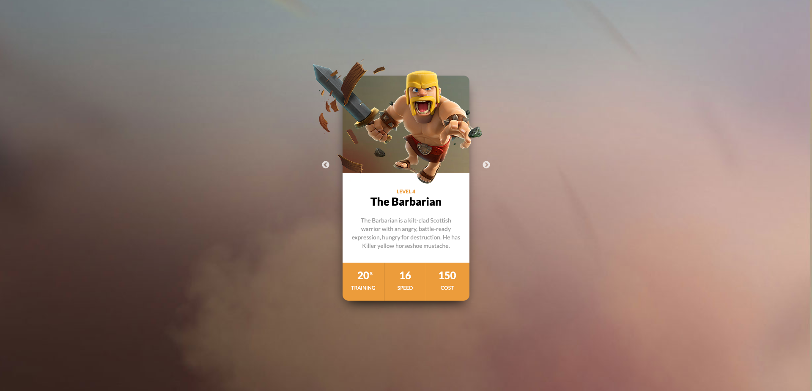

# Clash of Clans - Barbarian Card

Este proyecto es una tarjeta de presentación inspirada en el personaje "Barbarian" del juego Clash of Clans. La tarjeta está diseñada con HTML y CSS, mostrando imágenes, estadísticas y una breve descripción del personaje.

## Estructura del Proyecto

- **index.html**: Página principal con la estructura de la tarjeta.
- **css/style.css**: Estilos personalizados para la tarjeta y sus elementos.
- **image/**: Imágenes utilizadas en la tarjeta.
- **design/**: Recursos de referencia de diseño.

## Características

- Diseño responsivo y centrado.
- Uso de fuentes personalizadas (Google Fonts).
- Imágenes posicionadas con precisión para crear una composición visual atractiva.
- Estadísticas del personaje presentadas de forma clara y visual.

## Cómo usar

1. Clona o descarga este repositorio.
2. Abre `index.html` en tu navegador web.
3. Asegúrate de mantener la estructura de carpetas para que las imágenes y estilos se carguen correctamente.

## Vista previa

## Créditos

- Inspirado en Clash of Clans de Supercell.
- Imágenes y diseño realizados para fines educativos.

---
Desarrollado por Emel Camargo